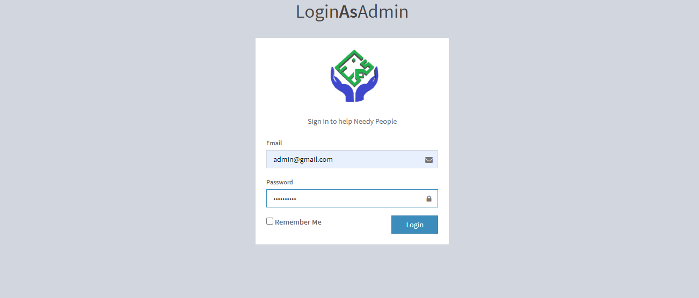

# imranCharity.org
this is an MIS created in Laravel 8 for Imran Charity Foundation which is a non-profitable charity organization that provides humanitarian assistance aid to those most in need. Run by a group of dedicated people inspired by equality and justice with the desire to save lives. Our team and volunteers are from the heart of your communities helping you make a difference.



## Admin
- Manage staffs
- Manage needy people
- Manage sponsors
- Manage reports
- Manage blog, contracts, donations etc… 

## Sponser
- Send donations
- View donations history
- View needy people
- Message to admin

## User
- Comment to blog post
- Send message to admin
- Become a volunteer
- Etc…


- admin credentials:
    ```
    email: admin@gmail.com
    password: afghan.com
    ```


## License
Copyright (c) Mamond. All rights reserved.
